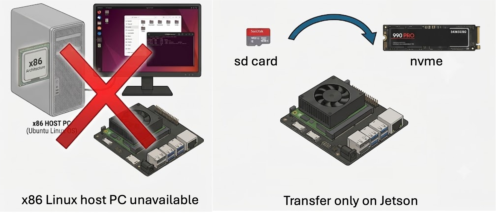

# Jetson Orin Nano: migrate a running system from SD card to NVMe SSD

**One command, run on the Jetson itself, moves a running JetPack 6 system from the microSD card onto an NVMe SSD. No second PC, no SDK Manager, no recovery mode, no re-flash.**

<p align="center">
  
</p>

```bash
sudo ./clone-sd-to-nvme.sh   # from the SD system, type YES when prompted
sudo poweroff                # pull the SD card, power on -> boots from NVMe
```

The script handles the three things a working NVMe boot needs on JetPack 6: the rootfs clone, a FAT **ESP** on the NVMe, and an **initrd rebuilt with the NVMe/PCIe drivers**. The last two are what most guides skip, which is why they end in "drops to UEFI shell" or "`nvme0n1p1 not found`".

---

## ✨ Why this exists

NVIDIA's official way to put the OS on NVMe is to re-flash the Jetson from an **x86 Linux host** running SDK Manager. That assumes hardware and software a lot of people don't have:

- **An x86 Ubuntu machine.** SDK Manager only runs on x86_64 Ubuntu. If all you own is Windows, a Mac, or an ARM laptop, the official path is a dead end before you even start.
- **A recovery-mode re-flash that actually works.** Putting the board into Force Recovery and flashing over USB is finicky, and plenty of people get stuck on SDK Manager errors.

The usual workaround people post is "just rsync the rootfs to the NVMe on the board." Two problems with those guides:

- **Almost all of them target JetPack 5 (L4T R35).** JetPack 6 (L4T R36) changed the boot path — UEFI now loads a bootloader from a FAT **ESP**, and the **initrd** must carry the NVMe + Tegra-PCIe drivers. Recipes written for JetPack 5 don't set either of those up, so they simply don't work on JetPack 6.
- **Even the ones that do target JetPack 6 usually stop after copying files.** So the board boots straight to the **UEFI shell** (no ESP) or fails with **`nvme0n1p1 not found`** (the initrd can't see the disk).

This script runs entirely **on the Jetson** and does all three steps correctly, so you pull the SD card and it just boots.

## ✅ Supported setup

| | Requirement |
| --- | --- |
| Device | Jetson Orin Nano / Orin NX Developer Kit |
| OS | **JetPack 6.x / L4T R36** (verified on R36.4.7) |
| Currently booting from | the **microSD card** (`findmnt /` shows `mmcblk*`) |
| Target | an installed **NVMe M.2 SSD** (will be **fully erased**) |

> ⚠️ The target NVMe is wiped. The **SD card is never touched** and stays a working fallback.

## 🚀 Quick start

```bash
git clone https://github.com/percyance/jetson-orin-nano-sd-to-nvme.git
cd jetson-orin-nano-sd-to-nvme
chmod +x *.sh troubleshooting/*.sh

sudo ./clone-sd-to-nvme.sh          # type YES when prompted

sudo poweroff                       # power off
# remove the microSD card
# power on -> boots from NVMe
```

Verify after boot:

```bash
findmnt /        # expect: /dev/nvme0n1p1
df -h /          # expect: the full SSD capacity
```

## 🧩 The three things that matter (why other guides fail)

A Jetson Orin Nano that boots from NVMe needs all three. Miss one and it won't come up:

| # | What it does | If you skip it |
| --- | --- | --- |
| 1 | **Clone the rootfs** — partition, format, `rsync` the whole root | nothing to boot |
| 2 | **Create an ESP** — a FAT32 EFI System Partition on the NVMe holding `BOOTAA64.efi` | UEFI has no loader to run and **drops to the UEFI shell / menu** |
| 3 | **Rebuild the initrd** — bake `nvme`, `pcie-tegra194`, `phy-tegra194-p2u` into `/boot/initrd` | kernel boots but can't see the disk: **`nvme0n1p1 not found`**, drops to `(initramfs)` |

`clone-sd-to-nvme.sh` does all three in one run.

## 📂 What's in here

```
clone-sd-to-nvme.sh          one-shot clone (recommended, does all three steps)
diagnose.sh                  read-only diagnostics; run it and paste the output when asking for help
troubleshooting/
  ├── add-esp.sh             already cloned but dropping to the UEFI shell -> add the ESP (no re-clone)
  └── fix-initrd.sh          getting nvme0n1p1 not found -> add the drivers to the initrd
```

## 🔧 Already cloned and stuck?

No need to start over — match the symptom (run everything from the SD system):

- **Drops to the UEFI shell / menu after removing the SD** → you're missing step 2, the ESP:
  ```bash
  sudo ./troubleshooting/add-esp.sh          # defaults to /dev/nvme0n1
  ```
- **`nvme0n1p1 not found`, drops to `(initramfs)`** → you're missing step 3, the initrd drivers:
  ```bash
  sudo ./troubleshooting/fix-initrd.sh
  ```
- **Not sure** → diagnose first:
  ```bash
  sudo ./diagnose.sh
  ```

## 🩺 How it works

The Orin Nano boots through UEFI:

```
UEFI firmware in QSPI
   └─ (BootOrder has an entry "UEFI <your NVMe>")
        └─ loads \EFI\BOOT\BOOTAA64.efi from the NVMe's FAT ESP        ← needs point 2
             └─ BOOTAA64.efi (NVIDIA L4TLauncher) reads extlinux.conf from the ext4 root
                  └─ loads Image + initrd per extlinux's root=/dev/nvme0n1p1
                       └─ initrd needs nvme/pcie drivers this early to mount the NVMe root   ← needs point 3
```

- **UEFI can't read ext4**, only the FAT ESP. So even if `rsync` copied `BOOTAA64.efi` into the ext4 root, UEFI can't use it — there has to be a separate FAT32 ESP partition.
- **When booting from SD, the initrd only needs the mmc driver;** the NVMe driver loads later, after the system is up. Booting from NVMe means the initrd has to bring `nvme` plus the Tegra PCIe controller/PHY drivers along from the very start.

What the script does, step by step:

1. `parted` creates `p1 = APP (ext4)` + `p2 = ESP (fat32, esp/boot flags)`
2. `rsync -aAXH /  →  NVMe:/` (excluding `/dev /proc /sys /tmp /run`, etc.)
3. copies `/boot/efi/EFI` (containing `BOOTAA64.efi`) into the NVMe's ESP
4. `sed`s extlinux's `root=` over to the NVMe partition
5. rewrites the NVMe's `/etc/fstab` so `/boot/efi` points at the NVMe's own ESP (`nofail`, so a missing ESP never blocks boot)
6. adds `nvme nvme_core pcie_tegra194 phy_tegra194_p2u` to `/etc/initramfs-tools/modules`, runs `update-initramfs -u`, and copies the result to the NVMe's `/boot/initrd`

## ↩️ Rollback

- **The SD card is untouched** — put it back in and it boots as before.
- Originals on the NVMe are backed up: `/boot/initrd.orig`, `extlinux.conf.sd.bak`, `fstab.sd.bak`.

## ⚠️ Notes

- The script appends a few lines to the **current SD system's** `/etc/initramfs-tools/modules`. This is idempotent and harmless — it only means initrds the SD builds later also carry the NVMe drivers — and it does not change how the SD boots.
- The target disk is **completely erased.** Make sure there's nothing on it you want to keep.
- The device is assumed to be `/dev/nvme0n1`. If yours differs, pass it as an argument to the troubleshooting scripts, or adjust the detection at the top of the main script.

## 📜 License

MIT — see [LICENSE](LICENSE). Use at your own risk; flashing carries risk, so understand what each step does before you run it.

## 🙏 Acknowledgements

Distilled from a real Orin Nano migration (JetPack 6 / L4T R36.4.7 + Samsung 990 PRO 1TB), turning the pitfalls it hit — the UEFI shell drop, `nvme0n1p1 not found` — into a script so you don't have to. Issues and PRs welcome.
